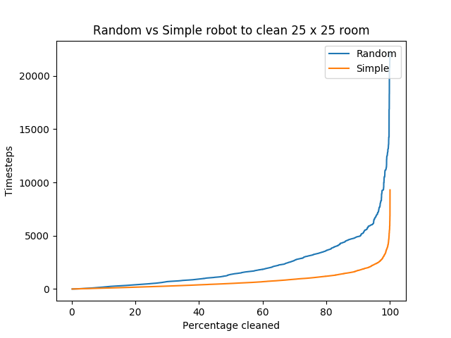
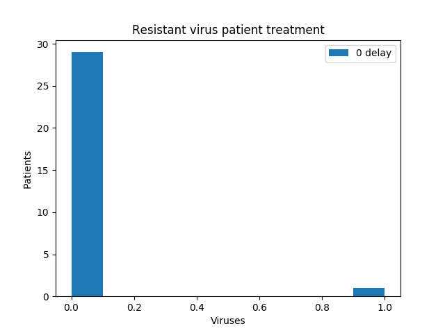
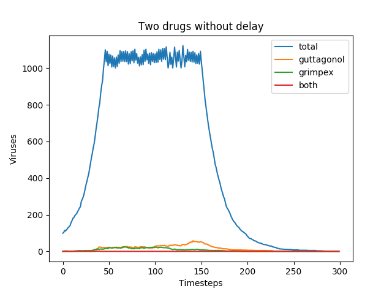
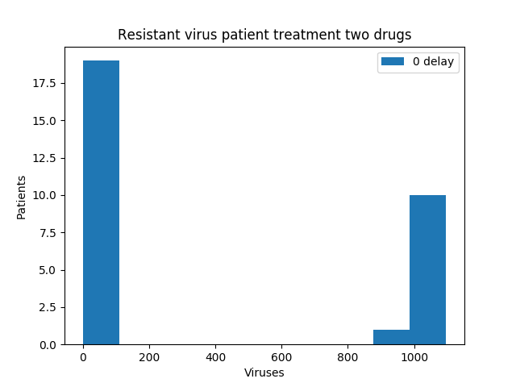
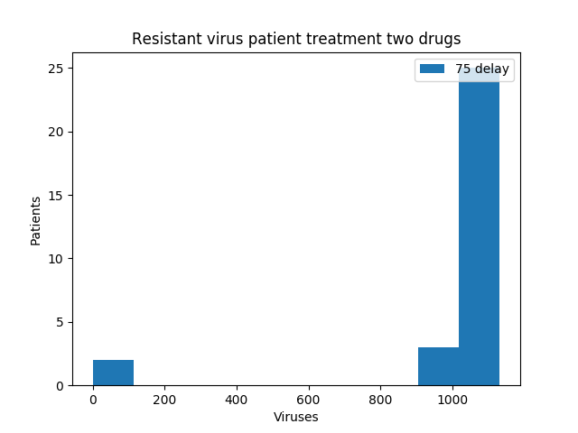
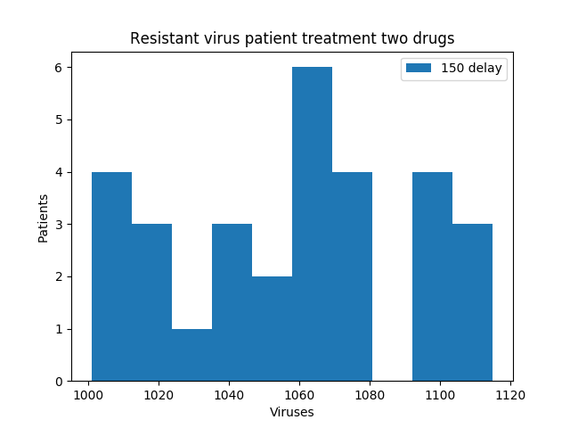

# [Introduction to Computer Science and Programming MIT-600](https://ocw.mit.edu/courses/electrical-engineering-and-computer-science/6-00-introduction-to-computer-science-and-programming-fall-2008/index.htm):
* video lectures
* assignments
* exams

## Robots

## Viruses

### Single drug

#### Histograms

### Two drugs

#### Histograms

## Prepare environment
- `brew install tcl-tk`
- `brew install python3 --with-tcl-tk`
